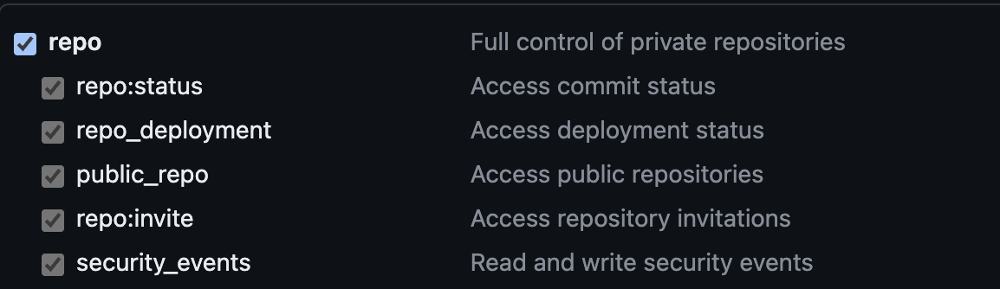

# kind-terraform
Project to create a kind local kubernetes cluster and install flux.

1. Create a github access token with the following permissions:
    
2. Copy the access token from the previous step and set it as terraform environment variable:
    ```
    # export TF_VAR_github_token=<your_token>
    ```
3. Run terraform to create the cluster and install flux:
    ```
    # cd terraform
    # terraform init
    # terraform plan
    # terraform apply
    ```